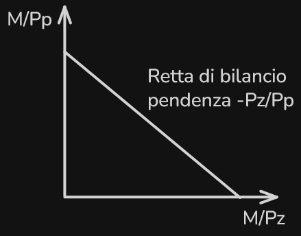

# Il vincolo di Bilancio

> **L’economia** tratta l’allocazione di risorse scarse.
> 

> **Microeconomia** → procedure decisionali degli individui
> 

**Vincolo di bilancio** → Costo del paniere di consumo $\leq$ Reddito

- https://it.wikipedia.org/wiki/Paniere

### Esempio:

$$
M = \text{Budget}
$$

$$
\begin{gather}
P = \text{Prezzo del bene}
\\
P_{(x)} \to \text {Costo Unitario di (x)} 
\\
X \to \text{ Quantità di bene (x) } 
\end{gather}
$$

$$
\begin{gather}
\text {Esempio Vincolo di bilancio}
\\
\begin{cases}
P_zZ + P_pP \leq M 
\\
Z \geq 0
\\
P \geq 0
\end{cases}
\end{gather}
$$

$$
\begin{gather}
\text{Retta di bilancio}
\\
P_zZ + P_pP = M 
\\
P = \frac{M}{P_P} - \frac {P_z}{P_P}Z
\end{gather}
$$

Rapporto dei prezzi * `-1`

- I panieri al di sopra della retta sono non ammissibili, in quanto il costo eccede le risorse disponibili
- I panieri che si trovano sulla retta comportano l'utilizzo di tutto il budget
- I panieri situati al di sotto della retta (nell'area colorata del grafico) sono definiti ammissibili, poiché la spesa è inferiore o uguale al budget
- Variazioni del Reddito (m): Un aumento del reddito provoca una traslazione parallela della retta verso l'alto (lontano dall'origine), mentre una diminuzione la trasla verso il basso, senza cambiarne la pendenza
- Variazioni dei Prezzi: Se cambia il prezzo di un solo bene (ad esempio a causa di una tassa specifica), la retta ruota attorno all'intercetta del bene il cui prezzo è rimasto invariato, modificando la sua pendenza
- Sussidi e Tasse Globali: Un sussidio globale aumenta il potere d'acquisto traslando la retta verso l'alto, mentre una tassa globale ha l'effetto opposto
- Per l'ipotesi di non sazietà, il consumatore preferisce quantità maggiori di beni; pertanto, il paniere scelto come "ottimo" deve trovarsi necessariamente sulla retta di bilancio e non al di sotto, per garantire che tutto il budget venga utilizzato per massimizzare la soddisfazione
