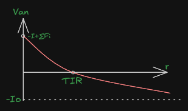

# TIR e Tempo di recupero
> 15.2.9; Capitolo 17 fino a 17.1.4;

>[!CAUTION]
>## Il metodo del TIR per la valutazione di progetti di investimento
>
>Per calcolare il VAN è necessario avere preliminarmente scelto il tasso di sconto `r`, senza il quale non sarebbe possibile attualizzare i flussi di cassa. La scelta di questo tasso è spesso problematica.
>
>$$
>VAN = - I_0 + \frac{F_1}{(1+r)^1} + \frac{F_1}{(1+r)^2} + ... + \frac{F_1}{(1+r)^n} = - I_0 \sum^{n}_{i=1} \frac{F_i}{(1+r)^i}
>$$
>
>Il **Tasso Interno di Rendimento (TIR)** permette di superare questo problema: il **TIR** è il **tasso di sconto** che rende il VAN del progetto pari a zero:
>
>
>$$
>-I_0 + \sum^{n}_{i=1} \frac{F_i}{(1+TIR)^i} = 0
>$$
>
>Attraverso il TIR è quindi possibile calcolare il tasso di sconto che mi permette di generare un rendimento attualizzato **perfettamente equivalente all’investimento**.
>- Se il TIR è maggiore del **tasso minimo accettabile**, il progetto è conveniente.
>- Se il TIR è uguale o minore del tasso minimo, il progetto non è conveniente.

***

>[!WARNING]
>## Si illustrino compiutamente i limiti del metodo del TIR nella valutazione dei progetti di investimento.
>
>1. Un primo limite del TIR è che non consente di confrontare correttamente progetti di investimento alternativi: un progetto con TIR minore può infatti presentare, per alcuni valori di $r$ un VAN superiore rispetto a un progetto con TIR maggiore.
>2. Un secondo limite del TIR è che se il polinomio che azzera il VAN ha più soluzioni, allora esistono più valori del TIR.
>3. Infine nel caso di un progetto di indebitamento, tra diversi progetti di indebitamento, devo scegliere quello con il TIR minore, e non quello con il TIR maggiore. La complessità della valutazione dei progetti reali porta spesso a cadere nella trappola di considerare il progetto con TIR maggiore.

## Si disegni l’andamento del VAN in funzione del tasso di sconto nel caso di investimento, indicando il TIR. Cosa cambia se si studia un progetto di indebitamento?

Il grafico mostra il VAN di un **progetto di investimento** in funzione del tasso di sconto `r`.
>-La curva **decresce al crescere di** `r`: i flussi futuri valgono meno se scontati a tassi più alti
>- Il TIR è il punto in cui $VAN = 0$
>- Si osserva che Il VAN è negativo per $r>TIR$ e positivo per $r<TIR$

Nel caso di un **progetto di indebitamento**, la situazione è speculare:

>- La curva del VAN **aumenta con il tasso di sconto**, perché i flussi negativi futuri vengono scontati più pesantemente.
>- Il VAN è negativo per $r<TIR$ e positivo per $r>TIR$
>

***

>[!IMPORTANT]
>## Si illustri brevemente il metodo del tempo di recupero per il confronto tra due investimenti
>
>Il metodo del **tempo di recupero (payback method)** valuta la convenienza di un progetto di investimento in base ai **periodi necessari affinché la cumulata dei flussi di cassa diventi nulla**, cioè affinché l’investimento iniziale venga recuperato. Nel confronto tra più progetti, si **preferisce quello che consente di recuperare l’esborso iniziale nel minor numero di periodi possibil**, purché il **tempo di recupero sia uguale o inferiore** a un valore soglia prefissato chiamato **cut-off**.
>
>>Si tratta di un metodo semplice e rapido, ma fortemente approssimato. Il suo principale limite è che non considera i flussi di cassa successivi al periodo di recupero e non tiene conto delle differenze nella durata complessiva dei progetti. Di conseguenza, si potrebbe erroneamente ritenere migliore un progetto con un periodo di recupero più breve, anche se un altro progetto, caratterizzato da un tempo di recupero più lungo, genera flussi di cassa significativamente più elevati negli anni successivi al cut-off.

***

>[!IMPORTANT]
># Qual è la differenza tra regime di capitalizzazione ad interesse semplice e ad interesse composto
>
>## Interesse semplice
>Nel regime di capitalizzazione ad interesse semplice, gli interessi maturano soltanto sull’investimento iniziale:
>
>$$
>\begin{gather}
>F_1=I_0+rI_0=I_0(1+r) \\
>F_2=I_0+rI_0+rI_0=I_0(1+2r)
>\end{gather}
>$$
>
>In generale dopo $n$ periodi:
>
>$$
>F_n=I_0(1+n*r)
>$$
>
>## Interesse composto
>
>Nel regime di capitalizzazione ad interesse composto, gli interessi oltre a maturare sull’investimento iniziale, maturano anche sugli interessi generati:
>
>$$
>\begin{gather}
>F_1=I_0+rI_0=I_0(1+r)\\
>F_2=I_0+rI_0+rI_0+r*rI_0= I_0(1+2r+r^2) = I_0(1+r)^2 \\
>\...
>\end{gather}
>$$
>
>Si può dimostrare che:
>
>$$
>F_n=I_0(1+r)^n
>$$
>
>*In questo caso il capitale cresce in modo esponenziale, perché gli interessi si "compongono".*
